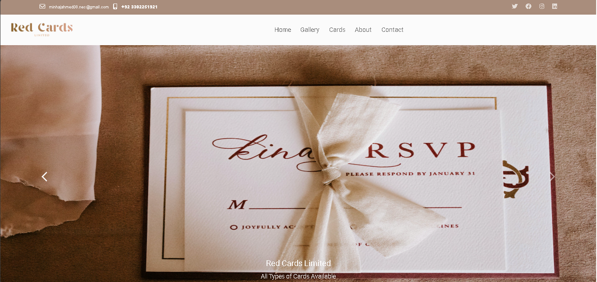
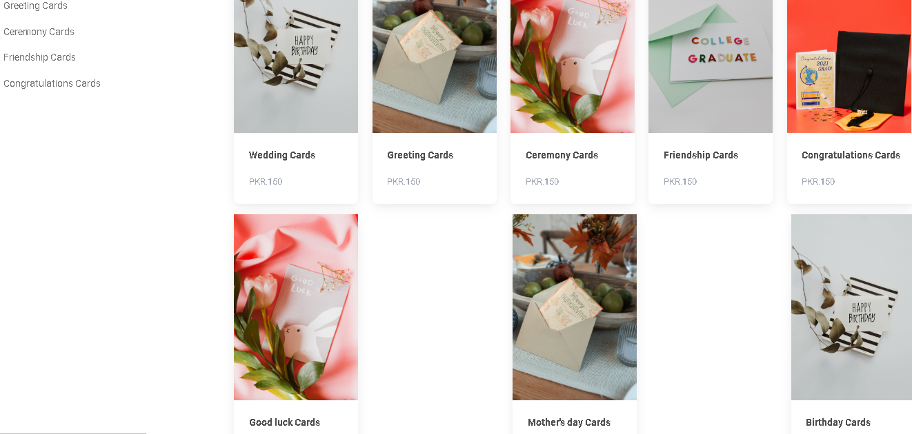

# E-Commerce Website (Frontend Project)

A responsive multi-page e-commerce website built using HTML, CSS, and Bootstrap. This project focuses on clean UI design and proper layout structuring.

---

## About This Project
This was a **group project** developed during my early learning phase (around 3–4 years ago) as part of an institute assignment.

The main goal was to understand:
- Frontend development basics  
- Multi-page website structure  
- Responsive design using Bootstrap  

> Note: This project is frontend-only and does not include JavaScript or backend functionality.

---

## Features
- Multi-page layout (Home, About, Contact, Product pages)  
- Responsive design using Bootstrap  
- Clean and organized UI  
- Structured file and folder system  

---

## Tech Stack
- HTML5  
- CSS3  
- Bootstrap  

---

## Team Work
This project was built collaboratively with a team of 4 members as part of an academic task.

---

## What I Learned
- Building structured multi-page websites  
- Using Bootstrap for responsiveness  
- Writing clean and organized HTML/CSS  
- Working in a team environment  

---

## 📸 Screenshots

---

## Live Demo
https://minhaj135.github.io/E-Commerce-Website/

---

## 💻 Author
**Minhaj Ahmed Khan**
